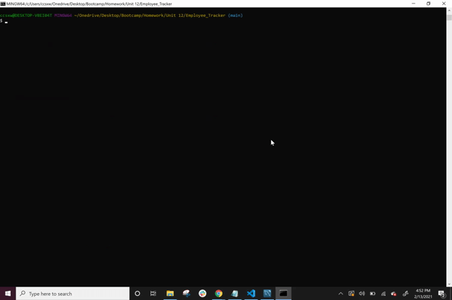

# Employee_Tracker

## Mock-Up

The following gif shows the functionality of this application. This application is a solution for managing a company's employees using node, inquirer, and MySQL. It is a command-line application that allows the user to:

* Add departments, roles, employees

* View departments, roles, employees

* Update employee roles

## Installation
Link to website:
[Web App Link](https://github.com/ccsxw6/Employee_Tracker)